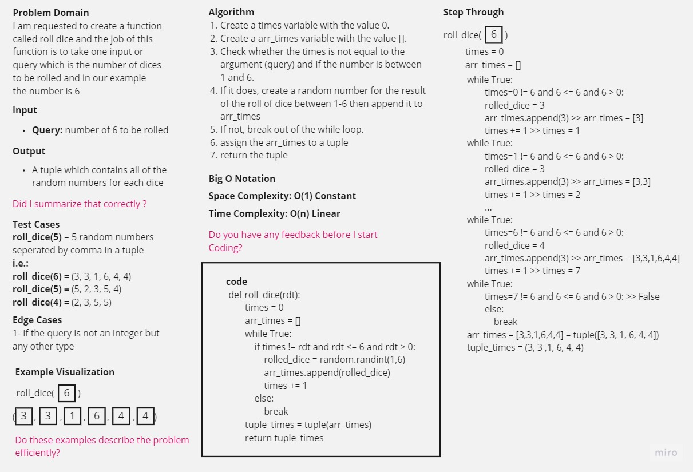
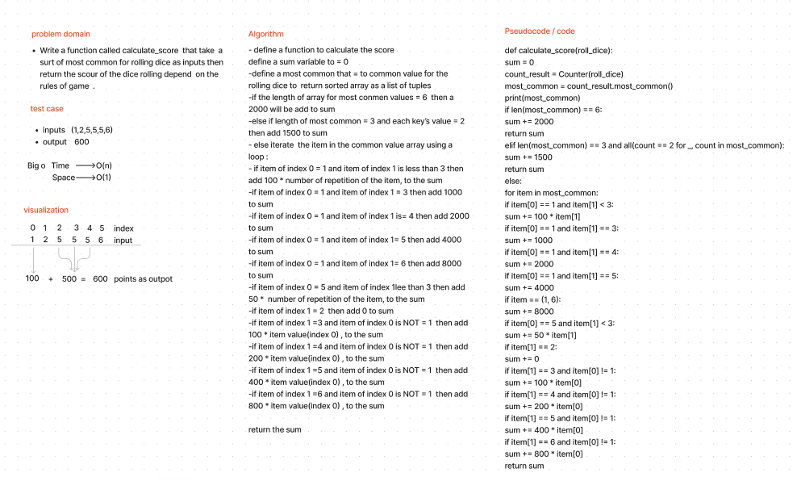

# ten-thousand

### LAB - Class 05
### Project: 
Roll dice (6)
### Author: 
Abdullah Abu Hamad
### Group Name: 
Group 7

### Setup
- N/A

### How to initialize/run your application (where applicable)
- to run the tests use: 
> source .venv/bin/activate 
- then run the following command:
> pytest

### Tests
#### How do I run tests for rolling dice? [tests](./tests/test_roll_dice.py)
#### How do I run tests for calculating score? [tests](./tests/test_calculate_score.py)

<!-- Describe any tests that you did not complete, skipped, etc -->
- there are three different tests that you can run but all are custom provided.

### Roll dice methods whiteboards

